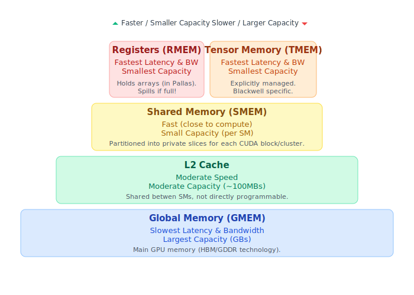

<p align="center">

</p>

`patches` is an experiment (first and foremost) - don't use it! Author is
futzing around with ideas from array programming frameworks, and Mojo.

## Goals

Here's what the author is trying to understand:

* How might staged metaprogramming work in Mojo via `alias` and comptime?
* Is this enough to encode a JAX-like array programming environment?
* Can staged metaprogramming operate on a kernel DSL (similar to `jax.pallas`,
  or Nvidia's `warp` library)?
* Can the staging language faithfully reflect _enough_ of the low-level details
  of e.g. layouts & tiling to be usefully used as a substrate for writing
  kernels, differentiating them, doing other spooky things with them, etc.

To answer these questions, the author is roughly following this set of tactics:

* Do a lot of reading.
  * What exactly are the concerns of systems like JAX, `jax.pallas`, `warp`?
* Do some coding.
  * Encode a "JAX-like" `Expr` representation _at compile time_ in Mojo. Write
      a tracing process that allows for construction of this representation out
      of `Mojo` `fn` types.
* Do some explorative thinking.
  * What if one extended the abstract lattice that JAX presents (`dtype` and
      `shape`) with "richer" information (reflecting underlying tensor
      information like layouts). Is this useful?

Here's the MVP (aim high!) concrete goal the author has set for himself:

* Express matmul as a program in the staged DSL, and differentiate it.

## Project log

### 05/09/2025 (Compile time staging in Mojo)

At compile time, able to do the following:

```mojo
fn f(x: Tensor) -> Tensor:
    return x + x + x * x

alias expr = stage1[f](
    tensor[
        DType.float32,
        Layout.col_major(3, 4),
    ]()
)
print(expr.value())
```

which prints the simple first-order DSL program:

```
{ lambda %0:f32[((3, 4):(1, 3))] .
  %1:f32[((3, 4):(1, 3))] = add %0 %0
  %2:f32[((3, 4):(1, 3))] = mul %0 %0
  %3:f32[((3, 4):(1, 3))] = add %1 %2
  return %3 }
```

Note that this program is in a functional style (closely following JAX). Kernel
DSLs do not look like this (they support mutable writes via "reference" or
thread primitives). The author is thinking about this next.

Lots of things wrong here (writing something for the first time!), but a good start.

### 05/10/2025 (Meditations on kernel programming)

Meditated deeper on the difference between JAX's purely functional array
programming model, and kernel DSLs. I'm hung up on the difference in UI between
these two models. My understanding _today_ is that kernel DSLs often support
_mutation_ idioms, and provide primitives and types designed to allow reading
and writing from locations in memory, along with ways to customize _where values
live in memory_, which is immensely important to maximize performance on
parallel accelerators.

#### Mojo's support for GPU kernels

As of _today_, I think of Mojo's GPU programming as exposing a sort of
full-featured kernel programming language. Within kernel functions, users have
access to thread and memory constructs (`gpu.id.block_idx`,
`gpu.id.thread_idx`). Having written a function, a user may
`DeviceContext.enqueue_function` - which compiles the function and readies it to
run on a given device.

Enqueueing it requires specifying things like grids of thread blocks. When the
function is run, the blocks are mapped to streaming multiprocessors (SM) (on the
GPU device) for execution. When an SM is assigned a thread block, it breaks the
block into _warps_ which are groups of 32 or 64 threads (depending on GPU).
Warps seem like the fundamental unit of SIMT execution.

The last paragraph is generic across several kernel programming models,
including Mojo and `pallas`. The details here are aligned with execution on
target hardware, and presumably exposing these details allow users to take
control of things which affect performance of their kernels.

#### Control over memory

Perhaps the central design issue here is control over memory, and how threads
read and write over memory. JAX fully hides this part of GPU programming from
the user - an immensely ergonomic design choice from the perspective of someone
who just wants to get a computation running on the GPU, and worry about memory
or layout optimization later.

When users start to reach for low-level control, mutability re-enters the
picture. Take `jax.pallas` for instance, which introduces a `Ref` type
(representing a mutable buffer at a location somewhere in GPU memory). The goal
of `jax.pallas` is to _restore_ access to the things which JAX has abstracted
away, so that users may use this access to improve the performance of their
programs.

Interestingly, `jax.pallas` integrates with JAX. How exactly does this work?
From the `jax.pallas` documentation, I believe that JAX allocates memory for its
arrays into high-bandwidth memory (HBM) - and then moves values from HBM to SRAM
during kernel computations. This is immensely costly!

The main goal of _kernel fusion optimization_ (which is possibly the most
important optimization that a compiler like XLA performs) is to reduce the
back-and-forth data movement from HBM and SRAM by taking multiple kernels, and
fusing them into a single kernel, meaning that multiple memory movement steps
are eliminated.

The following picture from the `jax.pallas` documentation illustrates the memory
hierarchy of a GPU:

<p align="center">

</p>

When a `jax.pallas` function is invoked inside of a JAX computation, an explicit
memory movement from GMEM to SMEM (SRAM?) is requested. From the documentation:

> [(`jax.pallas`) Hello world in Pallas](https://docs.jax.dev/en/latest/pallas/quickstart.html#hello-world-in-pallas)
>
> On GPU, `x_ref` corresponds to a value in high-bandwidth memory (HBM) and when
> we do `x_ref[...]` we are copying the value from HBM into static RAM (SRAM)
> (this is a costly operation generally speaking!). We then use GPU vector
> compute to execute the addition, then copy the resulting value in SRAM back to
> HBM.

What about intermediates which are materialized as part of the computation of a
kernel?

> [(`jax.pallas`) Memory spaces](https://docs.jax.dev/en/latest/pallas/gpu/reference.html#memory-spaces)
>
> Finally, the lowest level memory space is the register memory. This is where
> every single value (i.e. JAX array) in a Pallas kernel will be located. If the
> compiler runs out of registers to store those arrays, it will insert spills,
> meaning that it will periodically store and reload values to memory. Those
> spills often introduce other significant performance degradations and so we
> recommend avoiding them. The warning messages about spills can be clearly seen
> in the ptxas messages during kernel compilation. To make them visible, run
> with MOSAIC_GPU_DUMP_PTXAS=1 in your environment.

Which seems to answer this questions: intermediates are materialized into
register memory. If intermediates spill over, movement to other parts of the
memory hierarchy are introduced, which are also costly.

#### JAX/XLA & MAX

Reflecting on the above: systems like JAX/XLA and Modular's MAX graph compiler
remove control from the user, to give them a convenient GPU programming model
which doesn't require that they think carefully about memory movement or layout,
etc.

These programming models allow users to write programs that represent a sequence
of kernel computations, then it's up to the compiler to allocate and orchestrate
memory. A worst case compiler might just execute the sequence of kernels one
after the other (moving results to and fro from HBM to SRAM). But the data
movement is immensely costly - so all compilers designed for real world use (XLA
& MAX) perform kernel or operator fusion to attempt to reduce data movements.

### 05/11/2025 (Array programming frameworks and languages)

My instinct when there are two programming models for a similar domain (JAX &
Pallas, for instance) is to first determine what the concerns are, and think
about whether they warrant two programming models (versus one model). Of course,
I know and trust the geniuses working on JAX and Pallas, so my gut intuition is
that there's good reasons to have a separation between (a) _flexible array
programming environment (ARRAY)_ and (b) _performance oriented kernel DSL
(KERNEL)_. It may not be practical to try and cohere the concerns and their
programming models!

My hunches _today_:

* (ARRAY) JAX is _concerned with_ providing a convenient programming model for _array
  processing_, which lives a level above the kernel level. Ignoring JAX's
  other nice automation (AD, vectorized map for autobatching), array processing
  boils down to stringing together a bunch of kernels into a composite
  computation, and JAX provides automation for transforming a program denoting
  an array computation into one which can execute on GPU. Much of the madness is
  hidden from the user.

* (KERNEL) Pallas is _concerned with_ allowing users to write their own kernels,
  giving them access to details that JAX allows them to ignore. Details like:
  grids of thread blocks, software pipelining, an implicit memory semantics
  where local values are stored in registers. When you write with `jax.pallas`,
  you're taking these concerns into your own hands.

Now, Pallas has some interesting JAX-like features. For instance, seemingly
Pallas kernels themselves can be represented by JAX's first order program
representation (`Jaxpr`) - with the addition of a `Ref` type. This may be an
implementation detail of Pallas' main concern (emitting a program from Python
code which can interact with some external MLIR compiler), but it's also nice
because Pallas uses the programmatic representation to extend
[some of JAX's automation to Pallas kernels](https://docs.jax.dev/en/latest/pallas/design/design.html#transforming-pallas).

### 05/11/2025 - TBD (Break to write paper)
Author is working on another project.
